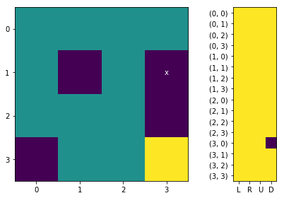
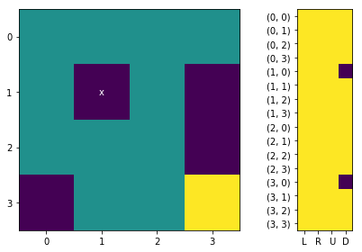

 
<div style='float:left;border:0px solid #ddd; height:100px; display:block;'>
<span style='font-size:18pt; margin-left:5px; display:block; margin-bottom:7px; font-weight:bold;'>Deep Learning Türkiye</span>
<span style='font-size:16pt; margin-left:5px; display:block; margin-bottom: 7px;'>Reinforcement Learning Lab Projesi</span>
<span style='font-size:14pt; margin-left:5px; display:block; margin-bottom: 7px;'>Openai - Frozen Lake</span>
<span style='font-size:12pt; margin-left:5px; display:block; margin-bottom: 7px; color:#888'>Alper Aydın</span>
</div>


Q-öğrenme, makine öğrenmede kullanılan bir Pekiştirmeli Öğrenme tekniğidir. Q-Öğrenimin amacı, ajana hangi koşullar altında hangi eylemde bulunacağını bildiren bir politika öğrenmektir. Çevrenin bir modelini gerektirmez ve uyarlama gerektirmeden stokastik geçişler ve ödüller ile ilgili sorunları ele alabilir.

ReinQ-Learning için kullanılan formül:


Önce ajanımızın içinde bulunduğu çevre, hareket kuralları, ödül şartları ve belleğini (Q-Table) hazırlıyoruz.


```python
import numpy as np
import pandas as pd
import random
import time

from IPython.core.display import clear_output
import matplotlib.pyplot as plt

env = []
pos_log = []
hrk_log = []
epoch_log = []
Qt = pd.DataFrame()
hareket_listesi = {}

def oyunu_hazirla():
    global env
    global hareket_listesi
    global Qt
    global epoch_log
    # ************ ÇEVRE     ******************
    # Önce ajanımızın hareket edeceği çevreyi (environment) tanımlıyoruz.
    # S: başlangıç, F: güvenli alan, H: delik, G: hedef 
    env =["SFFF",
          "FHFH",
          "FFFH",
          "HFFG"]
    print('Çevre:')
    print('\n'.join(env), '\n')


    # ************ HAREKETLER ******************
    # hareket seçeneklerimiz (actions) ve bu hareketlerin sonucunda pozisyonundaki değişim
    # örnek: ajan (x:0,y:0) pozisyonundayken 'R' aksiyonunu alırsa (1,0) yeni pozisyonu (0,0)+(1,0)=(x:1,y:0) olacaktır
    #        (x:1,y:0) pozisyonundayken 'D' aksiyonunu alırsa (0,1) yeni pozisyonu (1,0)+(0,1)=(x:1, y:1) olacaktır.
    hareket_listesi = {'L':(-1,0), 'R':(1,0), 'U':(0,-1), 'D':(0,1)}
    hareket_listesi_r = dict(zip(hareket_listesi.values(), hareket_listesi.keys()))
    print('Hareketler:\n', hareket_listesi,'\n')

    # ************ Q-TABLE **********************
    # şimdi de ajanımızın hangi durumda hangi aksiyonu seçmesi gerektiğine karar verirken bellek olarak kullanacağı 
    # puan tablosunu oluşturuyoruz. Q-Table olarak adlandırılan bu tablo tüm pozisyon ve aksyion alternatifleri için 
    # ajanın öğrendiği ağırlıkları tutmak için kullanılmakdadır. 

    # Q-Table'ın sütunlarını hareketler [L,R,U,D] oluşturmaktadır. Bu hareketleri aksiyonları tanımlarken belirlemiştik. 
    cols=hareket_listesi.keys()

    # satırlarını ise pozisyon alternatifleri (STATE) [(0,0),(0,1),...,(3,3)] oluşturmaktadır.
    rows=[]
    for x in range( len(env[0]) ):
        for y in range( len(env)):
            rows.append((x,y))

    # başlangıç değeri olarak tüm Q-Table değerleri 0 olarak belirlenir.
    vals=np.zeros((len(rows), len(cols)))
    Qt = pd.DataFrame(data=vals, index=rows, columns=cols)
    print('Q-Table:')
    print(Qt)
    
    # ************ DİĞER DEĞİŞKENLER ******************
    # ajanımızın pozisyonlarını, hareketlerini ve eğitim bilgilerini tutacağımız üç log tablosu oluşturuyoruz
    pos_log = []
    hrk_log = []
    epoch_log = []
    
```

<br><br/>
Tanımlama işlemlerinden sonra öğrenme işlemi ile devam ediyoruz.

Reinforcement Learning'de ajanın öğrenmesi deneme-yanılma ile gerçekleşmektedir. Ajan bulunduğu pozisyonundan (state) farklı bir pozisyona geçerken bir hangi alternatif pozisyonu seçeceğine dair bir karar vermesi gerekiyor. Bunun için varsa geçmişte öğrendiği deneyimlerinden faydalanıyor. Henüz deneyimlemediği bir pozisyonda ise rasgele olarak karar veriyor. Bu duruma ilave olarak ajanın deneyimlerine ilave olarak denemediği yolları keşfederek öğrenmesini de öğrenmesini isteriz. Ajanın keşfetme yada koruma (exploration/exploitation) kararı için epsilon adı verilen bir değer kullanıyoruz. Bu değer ajanın mevcut deneyimlerine göre mi seçim yapacağı yoksa keşfetmek için rastgele seçim mi yapacağını belirlemektedir.

Öğrenme süresince iki farklı döngü kullanıyoruz.
* Oyun döngüsü (iteration): ajanın başladığı pozisyonunda (initial state) oyun dışı kaldığı veya oyunu bitidiği (terminal state) pozisyona kadar geçirdiği sürede ajanın hareketlerini oluşturan döngüdür.
* Eğitim döngüsü (epoch): ajanın oyunu öğrenmek için kullanacağı döngüdür. Her epoch bir oyun döngüsünden oluşur, eğitim süresince ajanın kaç oyun oynayacağını belirler.

* Her oyun döngüsünde ajan başlangıç pozisyonundan oyuna başlar.
* Bulunduğu pozisyondayken hangi aksiyonu alabileceğine karar vermek için (hareket_sec()) QTable'a bakar. Burada en yüksek değere sahip hareket(ler)i belirler. Aynı en yüksek değere sahip birden fazla hareket seçeneği varsa bunlar arasında rastgele tercih yapar. Bu esnada başka bir rastgele tercih ile en iyi aksiyonu mu yoksa tüm hareket seçenekleri arasından rastgele bir tanesini mi seçeceğine karar verir (epsilon). 
* Hareket seçimini yaptıktan sonra bu hareketi gerçekleştirerek (hareket_et()) yeni bir pozisyona geçer. 
* Yeni geçtiği pozisyona ait ödül hesaplanır (odul_hesapla()).
* Ajanın kazandığı ödüle göre ajanın belleği (QTable) güncellenir (tabloyu_guncelle())
* Ajanın geçtiği yol ve hareketler gerektiğinde incelenmek üzere loga eklenir. 
* Yeni eğitim döngüsü başlatılır 

Şimdi öğrenme algoritmamızda kullanılacak hiper-parametrelerimizi belirliyoruz. Hiper-parametre'yi algoritmaların kullandığı alternatif teknik ve/veya değerler olarak tanımlayabiliriz. Bu örnekte kullanacağımız hiper parametreler;
* epoch: eğitim döngüsünün kaç turdan oluşacağını belirliyoruz
* max_act: oyun döngüsü içerisinde en fazla kaç hamle yapabileceğini sınırlıyoruz.
* learning_rate: yeni öğrenilen bilginin önem seviyesini belirler (float: [0-1]; 0:önemsiz, 1:önemli) 
* discount_rate: gelecekteki ödülün önem seviyesini belirler. (float: [0-1]; 0:şimdiki ödül önemli, 1:gelecek ödül önemli)
* initial state: ajanın oyuna başladığı pozisyon (tuple(int,int))
* epsilon: koruma/keşfetme oranını belirler, (float [0-1]; 0:keşfedici, 1:korumacı)
* verbose: eğitim sırasında öğrenme deneyimlerinin gösterilip gösterilmeyeceğini belirler (boolean)


```python
epochs = 2000
max_act = 100
learning_rate = 0.3
discount_rate = 0.8
initial_state = (0,0)
epsilon = 0.8
verbose = False
```

Artık ajanımızın eğitimine başlayabiliriz. Ama öncesinde ajanımızın eğitimi sırasında kullanacağımız fonksiyonları tanımlayalım.

Ardından egit() fonksiyonu ile eğitim ve oyun döngülerimize başlıyoruz


```python
#np.random.seed(1)

def hareket_sec(mevcut_durum):
    #qr = Qt.index.get_loc(mevcut_durum) #pozisyonun tabloda hangi satırda olduğunu buluyoru
    #act = np.array(Qt.iloc[qr,:]) # sonra bu satırdaki tüm aksiyonların değerlerini alıyoruz [L,U,R,D]=[0.8, 1.2, 0.3, 0.6]
    #rnd = np.random.randn(1, len(act)) # aksiyonların sayısı kadar rastgele rakam oluşturuyoruz    
    #max_val_index = np.argmax(act+rnd) # aksiyonlar ile rastgele değerleri toplayıp en yüksek değere sahip aksiyonun indexini buluyoruz : 1 (U=1.2)
    
    mevcut_durum_sira = Qt.index.get_loc(mevcut_durum)
    qts = Qt.iloc[mevcut_durum_sira,:] # Qt tablosunun mevcut_durum için alabileceği aksiyonlardaki değerleri alıyoruz
    qtsx = Qt.iloc[1,:].max() #bu değerlerin en büyüğünü buluyoruz
    qtsxa = Qt.iloc[1,:][Qt.iloc[1,:]==qtsx] # en büyük değere sahip olan aksiyon sayısı birden fazla olabileceği için tüm aksiyonları alıyoruz

    if random.random()>epsilon: # explore-exploit tercihini yapıyoruz, eğer random değer epsilondan büyükse 
        hareket = random.choice(list(hareket_listesi.keys())) # explore yapıp tamamen rastgele bir hareket seçiyoruz
        if verbose==True: print('Rastgele hareket seçildi: %s, en değerli hareket %s' % (hareket,random.choice(qtsxa.index)))
    else: # değilse
        hareket = random.choice(qtsxa.index) # exploid yapıp en büyük değere sahip aksiyonlar arasından birisini seçiyoruz.
        if verbose==True: print('En değerli hareket seçildi: %s' % hareket)

    return hareket

def hareket_et(mevcut_pos, hareket):
    yeni_pos = tuple(np.array(mevcut_pos) + np.array(hareket_listesi[hareket]))
    if yeni_pos[0]<0 or yeni_pos[1]<0 or yeni_pos[0]>len(env[0])-1 or yeni_pos[1]>len(env)-1:
        yeni_pos = mevcut_pos
    yeni_pos_harf = env[yeni_pos[1]][yeni_pos[0]]
    return  yeni_pos, yeni_pos_harf

def odul_hesapla(pos):
    pos_harf = env[pos[1]][pos[0]] # env listesinden bulunduğu pozisyonun harfini belirliyoruz
    if pos_harf=='G': odul = 1 # eğer ajan 'G' (hedef') harfindeyse ödülü 1
    elif pos_harf=='H': odul = -1 # eğer 'H' (delik) harfindeyse ödülü -1
    else: odul = 0 # diğer harflerden birindeyse ('S','F') ödülü 0 oluyor
    return odul

def tabloyu_guncelle(mevcut_pos, hareket, yeni_pos, odul):
    qrm = Qt.index.get_loc(mevcut_pos) #mevcut pozisyonun tablodaki satır numarası
    qry = Qt.index.get_loc(yeni_pos) #yeni pozisyonun tablodaki satı numarası
    
    qval_mevcut_pos = Qt.iloc[qrm,][hareket] # mevcut pozisyondaki 'hareket' aksiyonu için QTable değerini alıyoruz
    qval_yeni_pos = Qt.iloc[qry,].values # yeni pozisyondaki tüm hareketlerin değerlerini alıyoruz
    
    if verbose==True: print(mevcut_pos,'+', hareket,'->', yeni_pos,' r:', odul, qval_yeni_pos)
    if verbose==True: print('Qt[%s,%s] += %s * (%s + max(%s)) = ' % (mevcut_pos, hareket, learning_rate, odul, qval_yeni_pos))
    
    #başlangıçta gösterdiğimiz formülü uygulayarak hareket sonucunda oluşan değerler ile QTable'ı güncelliyoruz.
    Qt.iloc[qrm,][hareket] = \
        (1 - learning_rate) * qval_mevcut_pos + \
        learning_rate * \
        (odul + discount_rate * max(qval_yeni_pos))
    
    if verbose==True: print(Qt.iloc[qrm,].values)

def egit(lr=learning_rate, dr=discount_rate, eps=epsilon, epochs=epochs, v=False):
    global learning_rate
    global discount_rate
    global epsilon
    global epoch_log
    global verbose
    
    learning_rate = lr
    discount_rate = dr
    epsilon = eps
    epochs = epochs
    verbose = v
    
    for e in range(epochs): # eğitim döngüsü
        if verbose==True: print('*'*30, 'YENİ EPOCH %s' % e , '*'*30 )
        # burada yeni bir oyun başlıyor
        #time.sleep(1)
        pos_log = [] # log dosyasını boşaltıyoruz
        hrk_log = []
        pos_log.append(initial_state) # ajanın başlangıç pozisyonunu log listemize ekliyoruz
        
        for i in range(max_act): # oyun döngüsü
            # ajanımızın en son bulunduğu pozisyonu verip bir sonraki aksiyonunu öğreniyoruz
            if verbose==True: print('Yeni Hamle', '-' * 50)
            mevcut_pos = pos_log[-1] # mevcut pozisyonu belirle
            hareket = hareket_sec(mevcut_pos) #en uygun aksiyonu seç
            yeni_pos,yeni_pos_harf = hareket_et(mevcut_pos, hareket) # seçilen aksiyona göre hareket et
            odul = odul_hesapla(yeni_pos) # hareket sonucundaki ödülü hesapla
            tabloyu_guncelle(mevcut_pos, hareket, yeni_pos, odul) # ajanın aldığı ödüle göre QTable güncellenir.
            
            pos_log.append(yeni_pos)
            hrk_log.append(hareket)
            
            if yeni_pos_harf in 'HG': # eğer ajanımız delik (H) veya hedef (G) pozisyonlarındaysa 
                hrk_log.append('_'+yeni_pos_harf) # hareket loguna son pozisyonu ekliyoruz
                epoch_log.append(hrk_log) # eğitim döngüsüne hareketlerin logunu ekliyoruz
                if verbose==True: print( ('x'*60)+'\n', 'Oyun döngüsü sonlandı: pos(%s):%s' % (yeni_pos, yeni_pos_harf))
                break # ve bu oyun döngüsünden çıkıyoruz
            else:
                continue
        if verbose==True: goster(e, yeni_pos, hrk_log)
        if verbose==True: print('*'*30, 'EPOCH SONU %s' % e , '*'*30 )
    
```


```python
def goster(e, pos, hrk_log):   
    # Bu bölüm eğitim boyunca öğrenilen bilgilerin gösterildii fonksiyondur, 
    # detaylarına bu proje kapsamında değinilmemiştir.
    envn = np.array([1 if c=='G' else -1 if c=='H' else 0 for r in env for c in r]).reshape(len(env),len(env[0]))
    f, axarr = plt.subplots(1, 2, gridspec_kw = {'width_ratios':[3, 1]})
    axarr[0].set_xticks(np.arange(len(env)))
    axarr[0].set_yticks(np.arange(len(env[0])))
    axarr[0].text(pos[0],pos[1],'x', ha="center", va="center", color="w")
    axarr[0].imshow(envn)
    
    axarr[1].set_xticks( np.arange(len(Qt.columns)))
    axarr[1].set_yticks( np.arange(len(Qt.index)))
    axarr[1].set_xticklabels( list(Qt.columns))
    axarr[1].set_yticklabels( list(Qt.index))
    axarr[1].imshow(Qt)
    
    f.tight_layout()
    #clear_output()
    plt.show()
    
    print('Epoch: %s' % e, ''.join(hrk_log) )
    
    e = len(epoch_log) if len(epoch_log)<5 else len(epoch_log)-6
    for i in range(len(epoch_log)-1, e, -1):
        print(i,''.join(epoch_log[i]))
        
    display(Qt)
    time.sleep(0.2)
    
def goster2(e):
    # Bu bölüm eğitim boyunca öğrenilen bilgilerin gösterildii fonksiyondur, 
    # detaylarına bu proje kapsamında değinilmemiştir.

    #clear_output()
    r1 = sum([ 1 if e[-1:][0]=='_G' else 0 for e in epoch_log])/len(epoch_log)
    a1 = np.mean([(len(e)-1) for e in epoch_log])
    if len(epoch_log)>50:
        r2 = sum([ 1 if e[-1:][0]=='_G' else 0 for e in epoch_log[-50:]])/len(epoch_log[-50:])
        a2 = np.mean(list(filter(lambda v:v!=None,[len(e)-1 if e[-1:]==['_G'] else None for e in epoch_log[-50:]])))
    else:
        r2 = r1
        a2 = a1
    print(e, round(r1,2), round(a1,2), round(r2,2), round(a2,2))
    time.sleep(0.5)
    
```


```python
oyunu_hazirla()
clear_output()
```


```python
egit(lr=0.3, dr=0.8, epochs=2, v=True)
```

    ****************************** YENİ EPOCH 0 ******************************
    Yeni Hamle --------------------------------------------------
    Rastgele hareket seçildi: U, en değerli hareket R
    (0, 0) + U -> (0, 0)  r: 0 [0. 0. 0. 0.]
    Qt[(0, 0),U] += 0.3 * (0 + max([0. 0. 0. 0.])) = 
    [0. 0. 0. 0.]
    Yeni Hamle --------------------------------------------------
    En değerli hareket seçildi: R
    (0, 0) + R -> (1, 0)  r: 0 [0. 0. 0. 0.]
    Qt[(0, 0),R] += 0.3 * (0 + max([0. 0. 0. 0.])) = 
    [0. 0. 0. 0.]
    Yeni Hamle --------------------------------------------------
    En değerli hareket seçildi: R
    (1, 0) + R -> (2, 0)  r: 0 [0. 0. 0. 0.]
    Qt[(1, 0),R] += 0.3 * (0 + max([0. 0. 0. 0.])) = 
    [0. 0. 0. 0.]
    Yeni Hamle --------------------------------------------------
    En değerli hareket seçildi: R
    (2, 0) + R -> (3, 0)  r: 0 [0. 0. 0. 0.]
    Qt[(2, 0),R] += 0.3 * (0 + max([0. 0. 0. 0.])) = 
    [0. 0. 0. 0.]
    Yeni Hamle --------------------------------------------------
    En değerli hareket seçildi: R
    (3, 0) + R -> (3, 0)  r: 0 [0. 0. 0. 0.]
    Qt[(3, 0),R] += 0.3 * (0 + max([0. 0. 0. 0.])) = 
    [0. 0. 0. 0.]
    Yeni Hamle --------------------------------------------------
    En değerli hareket seçildi: D
    (3, 0) + D -> (3, 1)  r: -1 [0. 0. 0. 0.]
    Qt[(3, 0),D] += 0.3 * (-1 + max([0. 0. 0. 0.])) = 
    [ 0.   0.   0.  -0.3]
    xxxxxxxxxxxxxxxxxxxxxxxxxxxxxxxxxxxxxxxxxxxxxxxxxxxxxxxxxxxx
     Oyun döngüsü sonlandı: pos((3, 1)):H
    





    Epoch: 0 URRRRD_H
    


<div>
<style scoped>
    .dataframe tbody tr th:only-of-type {
        vertical-align: middle;
    }

    .dataframe tbody tr th {
        vertical-align: top;
    }

    .dataframe thead th {
        text-align: right;
    }
</style>
<table border="1" class="dataframe">
  <thead>
    <tr style="text-align: right;">
      <th></th>
      <th>L</th>
      <th>R</th>
      <th>U</th>
      <th>D</th>
    </tr>
  </thead>
  <tbody>
    <tr>
      <th>(0, 0)</th>
      <td>0.0</td>
      <td>0.0</td>
      <td>0.0</td>
      <td>0.0</td>
    </tr>
    <tr>
      <th>(0, 1)</th>
      <td>0.0</td>
      <td>0.0</td>
      <td>0.0</td>
      <td>0.0</td>
    </tr>
    <tr>
      <th>(0, 2)</th>
      <td>0.0</td>
      <td>0.0</td>
      <td>0.0</td>
      <td>0.0</td>
    </tr>
    <tr>
      <th>(0, 3)</th>
      <td>0.0</td>
      <td>0.0</td>
      <td>0.0</td>
      <td>0.0</td>
    </tr>
    <tr>
      <th>(1, 0)</th>
      <td>0.0</td>
      <td>0.0</td>
      <td>0.0</td>
      <td>0.0</td>
    </tr>
    <tr>
      <th>(1, 1)</th>
      <td>0.0</td>
      <td>0.0</td>
      <td>0.0</td>
      <td>0.0</td>
    </tr>
    <tr>
      <th>(1, 2)</th>
      <td>0.0</td>
      <td>0.0</td>
      <td>0.0</td>
      <td>0.0</td>
    </tr>
    <tr>
      <th>(1, 3)</th>
      <td>0.0</td>
      <td>0.0</td>
      <td>0.0</td>
      <td>0.0</td>
    </tr>
    <tr>
      <th>(2, 0)</th>
      <td>0.0</td>
      <td>0.0</td>
      <td>0.0</td>
      <td>0.0</td>
    </tr>
    <tr>
      <th>(2, 1)</th>
      <td>0.0</td>
      <td>0.0</td>
      <td>0.0</td>
      <td>0.0</td>
    </tr>
    <tr>
      <th>(2, 2)</th>
      <td>0.0</td>
      <td>0.0</td>
      <td>0.0</td>
      <td>0.0</td>
    </tr>
    <tr>
      <th>(2, 3)</th>
      <td>0.0</td>
      <td>0.0</td>
      <td>0.0</td>
      <td>0.0</td>
    </tr>
    <tr>
      <th>(3, 0)</th>
      <td>0.0</td>
      <td>0.0</td>
      <td>0.0</td>
      <td>-0.3</td>
    </tr>
    <tr>
      <th>(3, 1)</th>
      <td>0.0</td>
      <td>0.0</td>
      <td>0.0</td>
      <td>0.0</td>
    </tr>
    <tr>
      <th>(3, 2)</th>
      <td>0.0</td>
      <td>0.0</td>
      <td>0.0</td>
      <td>0.0</td>
    </tr>
    <tr>
      <th>(3, 3)</th>
      <td>0.0</td>
      <td>0.0</td>
      <td>0.0</td>
      <td>0.0</td>
    </tr>
  </tbody>
</table>
</div>


    ****************************** EPOCH SONU 0 ******************************
    ****************************** YENİ EPOCH 1 ******************************
    Yeni Hamle --------------------------------------------------
    En değerli hareket seçildi: U
    (0, 0) + U -> (0, 0)  r: 0 [0. 0. 0. 0.]
    Qt[(0, 0),U] += 0.3 * (0 + max([0. 0. 0. 0.])) = 
    [0. 0. 0. 0.]
    Yeni Hamle --------------------------------------------------
    En değerli hareket seçildi: L
    (0, 0) + L -> (0, 0)  r: 0 [0. 0. 0. 0.]
    Qt[(0, 0),L] += 0.3 * (0 + max([0. 0. 0. 0.])) = 
    [0. 0. 0. 0.]
    Yeni Hamle --------------------------------------------------
    En değerli hareket seçildi: L
    (0, 0) + L -> (0, 0)  r: 0 [0. 0. 0. 0.]
    Qt[(0, 0),L] += 0.3 * (0 + max([0. 0. 0. 0.])) = 
    [0. 0. 0. 0.]
    Yeni Hamle --------------------------------------------------
    En değerli hareket seçildi: L
    (0, 0) + L -> (0, 0)  r: 0 [0. 0. 0. 0.]
    Qt[(0, 0),L] += 0.3 * (0 + max([0. 0. 0. 0.])) = 
    [0. 0. 0. 0.]
    Yeni Hamle --------------------------------------------------
    En değerli hareket seçildi: L
    (0, 0) + L -> (0, 0)  r: 0 [0. 0. 0. 0.]
    Qt[(0, 0),L] += 0.3 * (0 + max([0. 0. 0. 0.])) = 
    [0. 0. 0. 0.]
    Yeni Hamle --------------------------------------------------
    En değerli hareket seçildi: U
    (0, 0) + U -> (0, 0)  r: 0 [0. 0. 0. 0.]
    Qt[(0, 0),U] += 0.3 * (0 + max([0. 0. 0. 0.])) = 
    [0. 0. 0. 0.]
    Yeni Hamle --------------------------------------------------
    En değerli hareket seçildi: R
    (0, 0) + R -> (1, 0)  r: 0 [0. 0. 0. 0.]
    Qt[(0, 0),R] += 0.3 * (0 + max([0. 0. 0. 0.])) = 
    [0. 0. 0. 0.]
    Yeni Hamle --------------------------------------------------
    En değerli hareket seçildi: L
    (1, 0) + L -> (0, 0)  r: 0 [0. 0. 0. 0.]
    Qt[(1, 0),L] += 0.3 * (0 + max([0. 0. 0. 0.])) = 
    [0. 0. 0. 0.]
    Yeni Hamle --------------------------------------------------
    Rastgele hareket seçildi: L, en değerli hareket D
    (0, 0) + L -> (0, 0)  r: 0 [0. 0. 0. 0.]
    Qt[(0, 0),L] += 0.3 * (0 + max([0. 0. 0. 0.])) = 
    [0. 0. 0. 0.]
    Yeni Hamle --------------------------------------------------
    Rastgele hareket seçildi: U, en değerli hareket U
    (0, 0) + U -> (0, 0)  r: 0 [0. 0. 0. 0.]
    Qt[(0, 0),U] += 0.3 * (0 + max([0. 0. 0. 0.])) = 
    [0. 0. 0. 0.]
    Yeni Hamle --------------------------------------------------
    En değerli hareket seçildi: R
    (0, 0) + R -> (1, 0)  r: 0 [0. 0. 0. 0.]
    Qt[(0, 0),R] += 0.3 * (0 + max([0. 0. 0. 0.])) = 
    [0. 0. 0. 0.]
    Yeni Hamle --------------------------------------------------
    En değerli hareket seçildi: D
    (1, 0) + D -> (1, 1)  r: -1 [0. 0. 0. 0.]
    Qt[(1, 0),D] += 0.3 * (-1 + max([0. 0. 0. 0.])) = 
    [ 0.   0.   0.  -0.3]
    xxxxxxxxxxxxxxxxxxxxxxxxxxxxxxxxxxxxxxxxxxxxxxxxxxxxxxxxxxxx
     Oyun döngüsü sonlandı: pos((1, 1)):H
    





    Epoch: 1 ULLLLURLLURD_H
    


<div>
<style scoped>
    .dataframe tbody tr th:only-of-type {
        vertical-align: middle;
    }

    .dataframe tbody tr th {
        vertical-align: top;
    }

    .dataframe thead th {
        text-align: right;
    }
</style>
<table border="1" class="dataframe">
  <thead>
    <tr style="text-align: right;">
      <th></th>
      <th>L</th>
      <th>R</th>
      <th>U</th>
      <th>D</th>
    </tr>
  </thead>
  <tbody>
    <tr>
      <th>(0, 0)</th>
      <td>0.0</td>
      <td>0.0</td>
      <td>0.0</td>
      <td>0.0</td>
    </tr>
    <tr>
      <th>(0, 1)</th>
      <td>0.0</td>
      <td>0.0</td>
      <td>0.0</td>
      <td>0.0</td>
    </tr>
    <tr>
      <th>(0, 2)</th>
      <td>0.0</td>
      <td>0.0</td>
      <td>0.0</td>
      <td>0.0</td>
    </tr>
    <tr>
      <th>(0, 3)</th>
      <td>0.0</td>
      <td>0.0</td>
      <td>0.0</td>
      <td>0.0</td>
    </tr>
    <tr>
      <th>(1, 0)</th>
      <td>0.0</td>
      <td>0.0</td>
      <td>0.0</td>
      <td>-0.3</td>
    </tr>
    <tr>
      <th>(1, 1)</th>
      <td>0.0</td>
      <td>0.0</td>
      <td>0.0</td>
      <td>0.0</td>
    </tr>
    <tr>
      <th>(1, 2)</th>
      <td>0.0</td>
      <td>0.0</td>
      <td>0.0</td>
      <td>0.0</td>
    </tr>
    <tr>
      <th>(1, 3)</th>
      <td>0.0</td>
      <td>0.0</td>
      <td>0.0</td>
      <td>0.0</td>
    </tr>
    <tr>
      <th>(2, 0)</th>
      <td>0.0</td>
      <td>0.0</td>
      <td>0.0</td>
      <td>0.0</td>
    </tr>
    <tr>
      <th>(2, 1)</th>
      <td>0.0</td>
      <td>0.0</td>
      <td>0.0</td>
      <td>0.0</td>
    </tr>
    <tr>
      <th>(2, 2)</th>
      <td>0.0</td>
      <td>0.0</td>
      <td>0.0</td>
      <td>0.0</td>
    </tr>
    <tr>
      <th>(2, 3)</th>
      <td>0.0</td>
      <td>0.0</td>
      <td>0.0</td>
      <td>0.0</td>
    </tr>
    <tr>
      <th>(3, 0)</th>
      <td>0.0</td>
      <td>0.0</td>
      <td>0.0</td>
      <td>-0.3</td>
    </tr>
    <tr>
      <th>(3, 1)</th>
      <td>0.0</td>
      <td>0.0</td>
      <td>0.0</td>
      <td>0.0</td>
    </tr>
    <tr>
      <th>(3, 2)</th>
      <td>0.0</td>
      <td>0.0</td>
      <td>0.0</td>
      <td>0.0</td>
    </tr>
    <tr>
      <th>(3, 3)</th>
      <td>0.0</td>
      <td>0.0</td>
      <td>0.0</td>
      <td>0.0</td>
    </tr>
  </tbody>
</table>
</div>


    ****************************** EPOCH SONU 1 ******************************
    
